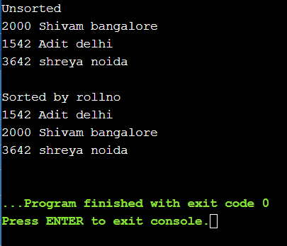

# Program-to-Sort-a-List
## MLH Local Day Hack: Build
Day-3 (Daily_challenges)
* Program written in Java.
* Demo user input is already written.
* Any the details is being sort according to Roll number of student. 

# OUTPUT PREVIEW 
